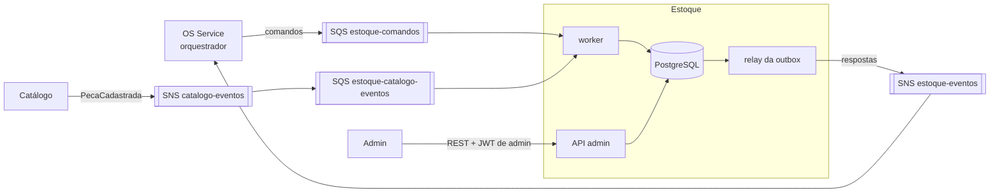

# oficina-mecanica-estoque

Microsserviço de **Estoque** do sistema da oficina mecânica (Tech Challenge FIAP, Fase 4): mantém o **saldo de cada peça** e as **reservas das ordens de serviço**. É participante da saga da OS: reserva as peças definidas no diagnóstico, faz a baixa depois do pagamento e desfaz uma ou outra quando a saga é compensada.

É um dos 5 microsserviços do sistema. A divisão, a saga e o contrato entre os serviços estão documentados no repositório principal, [oficina-mecanica-fiap](https://github.com/phantosmia/oficina-mecanica-fiap):

- [RFC-0006: decomposição em microsserviços](https://github.com/phantosmia/oficina-mecanica-fiap/blob/main/docs/rfcs/0006-decomposicao-em-microsservicos.md)
- [ADR-0008](https://github.com/phantosmia/oficina-mecanica-fiap/blob/main/docs/adrs/0008-saga-orquestrada-no-os-service.md) e [ADR-0010](https://github.com/phantosmia/oficina-mecanica-fiap/blob/main/docs/adrs/0010-diagnostico-define-o-orcamento.md): a saga orquestrada
- [ADR-0009: persistência poliglota (por que PostgreSQL aqui)](https://github.com/phantosmia/oficina-mecanica-fiap/blob/main/docs/adrs/0009-persistencia-poliglota-por-servico.md)
- [`docs/saga.md`: contrato de mensagens entre os serviços](https://github.com/phantosmia/oficina-mecanica-fiap/blob/main/docs/saga.md)

## Papel no sistema



| Mensagem recebida | Efeito | Resposta |
|---|---|---|
| `ReservarPecas` | Reserva o saldo de todas as peças do diagnóstico, **tudo ou nada** | `PecasReservadas` ou `ReservaRecusada` (com quais peças faltaram e quanto havia) |
| `ConfirmarBaixa` | A reserva vira baixa definitiva (depois do pagamento) | `BaixaConfirmada` ou `BaixaFalhou` |
| `LiberarPecas` | Compensação: desfaz a reserva | `PecasLiberadas` (sempre) |
| `DevolverPecas` | Compensação: devolve ao estoque o que já foi baixado | `PecasDevolvidas` (sempre) |
| `PecaCadastrada` (evento do Catálogo) | Cria o saldo zerado da peça nova | — |

## Arquitetura do serviço

Clean Architecture, a mesma organização dos outros serviços:

```
app/
├── stock/
│   ├── domain/        # StockItem (regras de saldo), Reservation, estados, interface da Unit of Work
│   ├── application/   # use_cases.py (API admin) e saga_handlers.py (participação na saga)
│   ├── adapters/      # Unit of Work com SQLAlchemy, presenters
│   ├── controller.py  # rotas REST
│   └── schemas.py
├── messaging/         # dispatcher (tipo da mensagem → caso de uso) e consumidor SQS
├── system/            # /health e /ready
├── shared/            # settings, banco, modelos, JWT, envelope, outbox, publicador SNS, tracing, logs
├── worker.py          # processo consumidor das filas
└── outbox_relay.py    # processo que publica a outbox no SNS
```

### Saldo: em estoque, reservado e disponível

- **Em estoque**: unidades fisicamente na oficina.
- **Reservado**: parte do que está em estoque prometida a uma OS que ainda não fez a baixa.
- **Disponível** = em estoque − reservado: o que pode ser reservado agora.

A regra "o saldo nunca fica negativo" está na entidade `StockItem` (domínio) e é repetida como `CHECK` no PostgreSQL, como rede de segurança.

### Reserva tudo ou nada, mesmo com concorrência

Ao receber `ReservarPecas`, o caso de uso trava as linhas de saldo das peças pedidas (`SELECT ... FOR UPDATE`, sempre em ordem de `part_id`, para duas reservas simultâneas não travarem uma à outra), confere se **todas** têm saldo disponível e só então reserva. Se faltar qualquer uma, nada é reservado. Há um teste com duas sagas disputando ao mesmo tempo as últimas unidades: só uma consegue.

### Uma transação por mensagem (Unit of Work)

Para cada mensagem, numa única transação:

1. registra o `message_id` como processado (idempotência: uma reentrega da mesma mensagem não faz nada);
2. aplica o efeito no saldo e na reserva e grava o histórico de movimentações;
3. grava a resposta na **outbox**.

O relay (`python -m app.outbox_relay`, processo separado) publica a outbox no SNS. Sem a outbox, o serviço poderia gravar a reserva e cair antes de responder (o orquestrador nunca saberia), ou responder e a transação falhar depois (resposta sobre uma reserva que não existe).

### Mensagens repetidas, atrasadas ou fora de ordem

A entrega do SQS é *at-least-once* e sem ordem garantida, então:

- **Mesma mensagem duas vezes** (mesmo `message_id`): ignorada na segunda.
- **Mesmo comando reenviado** pelo orquestrador depois do prazo (novo `message_id`): devolve a mesma resposta, sem repetir o efeito. A reserva é única por saga.
- **Compensação chegando antes da reserva**: `LiberarPecas` sem reserva registra a saga como já compensada; se o `ReservarPecas` chegar depois, é recusado (`saga_ja_compensada`) em vez de prender estoque que ninguém vai liberar.
- **Compensações sempre confirmam**, mesmo sem nada a desfazer, para o orquestrador poder reenviá-las com segurança.

### Falha de negócio x falha técnica

- **Falha de negócio** (faltou saldo, reserva inexistente) vira evento de falha (`ReservaRecusada`, `BaixaFalhou`) e a mensagem é removida da fila.
- **Falha técnica** (banco fora do ar, bug) levanta exceção: a mensagem **não** é removida, volta a ficar visível e é tentada de novo. Depois de 5 tentativas, a política de *redrive* da fila a move para a DLQ. Mensagem malformada segue o mesmo caminho.

## API

Swagger em `http://localhost:8002/docs` (docker-compose). Todas as rotas, exceto `/health` e `/ready`, exigem o JWT de admin emitido pelo OS Service. Reservas e baixas **não** têm rota: chegam só pela saga.

| Método | Rota | Descrição |
|---|---|---|
| `GET` | `/stock` | Saldos (em estoque, reservado, disponível, mínimo). `?below_minimum=true` lista só o que precisa de reposição |
| `GET` | `/stock/{part_id}` | Saldo de uma peça |
| `POST` | `/stock/{part_id}/entries` | Entrada de estoque (reposição), com observação opcional (ex.: nota fiscal) |
| `PUT` | `/stock/{part_id}/minimum` | Altera o estoque mínimo |
| `GET` | `/stock/{part_id}/movements` | Histórico: entradas, reservas, liberações, baixas e devoluções |
| `GET` | `/reservations/{saga_id}` | Situação da reserva de uma saga (útil para acompanhar a saga na demonstração) |
| `GET` | `/health` | *Liveness* |
| `GET` | `/ready` | *Readiness*: banco acessível e migrations aplicadas |

## Como rodar

### Docker Compose

```bash
docker compose up --build
```

Sobe PostgreSQL, LocalStack (SQS/SNS), aplica as migrations com o saldo inicial de exemplo e inicia API (`http://localhost:8002`), worker e relay. As filas e o tópico são criados na subida (`scripts/bootstrap_local.py`).

Para gerar um token de admin sem subir o OS Service:

```bash
poetry run python -c "from jose import jwt; import time; print(jwt.encode({'sub': 'admin', 'exp': time.time() + 3600}, 'change-me-in-production', algorithm='HS256'))"
```

### Testes

```bash
poetry install
poetry run pytest
```

- **PostgreSQL de verdade**, via Testcontainers (precisa de Docker). Para usar um banco já existente, defina `TEST_DATABASE_URL`. De propósito, os testes **não** usam `DATABASE_URL`: eles apagam os dados a cada caso.
- **SQS e SNS simulados** pelo [moto](https://github.com/getmoto/moto), incluindo o caminho completo fila → worker → banco → outbox → relay → tópico → fila do orquestrador.
- Cobertura mínima exigida: 80% (`pyproject.toml`).

## Dados de exemplo

`scripts/seed.py` cria o saldo das mesmas 5 peças dos dados de exemplo do Catálogo, **com os mesmos IDs** (UUID v5 do SKU, no mesmo namespace), sem precisar consultar o Catálogo. Roda no `migrate` quando `SEED_ON_MIGRATE=true`.

## Configuração

| Variável | Padrão | Descrição |
|---|---|---|
| `DATABASE_URL` ou `POSTGRES_HOST`/`PORT`/`USER`/`PASSWORD`/`DB` | `localhost:5432`, `estoque`/`estoque`, `oficina_estoque` | Banco |
| `ESTOQUE_COMMANDS_QUEUE_URL` | — | Fila de comandos da saga |
| `ESTOQUE_CATALOG_EVENTS_QUEUE_URL` | — | Fila que assina o tópico de eventos do Catálogo |
| `ESTOQUE_EVENTS_TOPIC_ARN` | — | Tópico SNS onde o Estoque publica as respostas |
| `AWS_REGION` | `us-east-1` | Região AWS |
| `AWS_ENDPOINT_URL` | — | Só local: endpoint do LocalStack |
| `JWT_SECRET_KEY` | `change-me-in-production` | Mesmo segredo do OS Service |
| `ADMIN_USERNAME` | `admin` | `sub` esperado no JWT de admin |
| `WORKER_WAIT_SECONDS` | `10` | *Long polling* do SQS |
| `OUTBOX_POLL_INTERVAL_SECONDS` | `2` | Intervalo do relay quando a outbox está vazia |
| `NEW_RELIC_LICENSE_KEY` | — | Ativa o agente APM do New Relic |
| `BOOTSTRAP_LOCAL_RESOURCES` / `SEED_ON_MIGRATE` | `false` | Só local: cria filas/tópico e carrega o saldo de exemplo |
